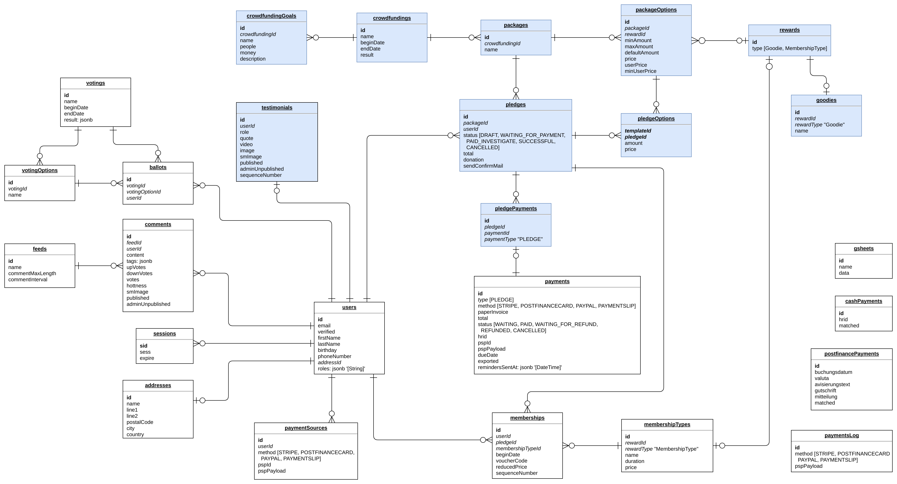

# Crowdfunding Server - Project R

# Introduction
This [NodeJS](https://nodejs.org) server provides an [GraphQL](http://graphql.org) API to power your next crowdfunding. [Postgres](https://www.postgresql.org/) acts as the database and is accessed by the amazing [pogi](https://github.com/holdfenytolvaj/pogi) client. It provides passwordless user signup and handles authentication with [express-session](https://github.com/expressjs/session).

This software is developped by [Project R](https://project-r.construction) and used to power our crowdfunding for [Republik](https://www.republik.ch).

Check out the API: [https://api.republik.ch/graphiql](https://api.republik.ch/graphiql)


## Quick start
You need to have postgres running somewhere.

Boostrap your .env file.
```
PORT=3001
PUBLIC_URL=http://localhost:3001
SESSION_SECRET=replaceMe
DATABASE_URL=postgres://postgres@localhost:5432/postgres
```

Bootstrap the DB.
```
npm run db:reset
```

Run it.
```
npm install
npm start
```
Check out the API: [http://localhost:3001/graphiql](http://localhost:3001/graphiql)


## Behind the scenes

### Database

TODO
- db-migrate
- seeds

### User handling
TODO
- passwordless
- express session

### Crowdfundings
TODO
- status
- submitPledge
- payPledge

### Payments
TODO

### Testimonials
TODO

### Gsheets
TODO

### Misc
**Emails** are sent via [Mandrill](https://mandrillapp.com) see [lib/sendMail.js](lib/sendMail.js). We make extensive use of mandrill templates to send custom styled HTML emails and also to convert them to text-only emails, see [lib/sendMailTemplate.js](lib/sendMailTemplate.js). You can find all our templates inside the [assets/email-templates](assets/email-templates) folder.

We store our **assets** inside [Exoscale's Object Store](https://www.exoscale.ch/object-storage/). It provides a S3 v3 compatible API, which we talk to via [lib/uploadExoscale.js](lib/uploadExoscale.js)

[Keycdn](https://www.keycdn.com) acts as **CDN** for our assets. [lib/keyCDN.js](lib/keyCDN.js) provides an easy way to purge the cache for specific urls.

We use [Phantomjscloud](https://phantomjscloud.com/) to render social-media images.


## Development

### Environment
There are many knobs which can be turned to, check the following extensive list. Provided values are just an example.
```
PORT=3001
SESSION_SECRET=
DATABASE_URL=postgres://postgres@localhost:5432/postgres
NODE_ENV=development

# used to construct links in mails sent
PUBLIC_URL=http://localhost:3001
# used to construct links/redirects to frontend
FRONTEND_BASE_URL=http://localhost:3003

# basic auth
# provide the following ENV variables to enable HTTP basic auth.
BASIC_AUTH_USER=
BASIC_AUTH_PASS=
BASIC_AUTH_REALM=

# set the auth cookie to a specific domain.
COOKIE_DOMAIN=

# whitelist requests from a specific domain
CORS_WHITELIST_URL=http://localhost:3003


# mandrill api key, used to send mail
MANDRILL_API_KEY=
# mails are not send in DEV, except SEND_MAILS is true
# mails are suppressed in production if SEND_MAILS is false
SEND_MAILS=true

# where to send auth mails from
AUTH_MAIL_FROM_ADDRESS="kontakt@republik.ch"
# where to send new (FA)Questions to
QUESTIONS_MAIL_ADDRESS="faq@republik.ch"
# where to send mails from (if no param specified for sendMail or sendMailTemplate)
DEFAULT_MAIL_FROM_ADDRESS="kontakt@republik.ch"
DEFAULT_MAIL_FROM_NAME=Republik

# mailchimp is used to subscribe people to lists
MAILCHIMP_API_KEY=
REMIND_ME_LIST_ID=
# random secret: used to sign the subscription link send by mail
SUBSCRIBE_SECRET=

# if truthy, @project-r.construction mail addresses get automatically
# signedin and no mail is sent (used for automated testing)
AUTO_LOGIN=1

# credentials to upload assets to the exoscale object store
EXO_KEY=
EXO_SECRET=
S3BUCKET=republik-staging
# where will the assets be available publicly
ASSETS_BASE_URL=https://assets.staging.republik.ch

# keyCDN access to clear cache on file uploads
# must correspond with the object store config
KEYCDN_API_KEY=
KEYCDN_ZONE_ID=
KEYCDN_ZONE_URL=

# phantomjscloud.com to render social media share images
PHANTOMJSCLOUD_API_KEY=


# payment secrets
PAYPAL_URL=
PAYPAL_USER=
PAYPAL_PWD=
PAYPAL_SIGNATURE=
PF_SHA_IN_SECRET=
PF_SHA_OUT_SECRET=
PF_PSPID=
STRIPE_SECRET_KEY=
```

## Scripts
### Upload images
Assets for public use are stored under `script/data/images`. Place a new image you want to upload there, then run `npm run upload:images`. The public URLs of the new images are then printed on the console. This script does not purge the cache of existing images.

